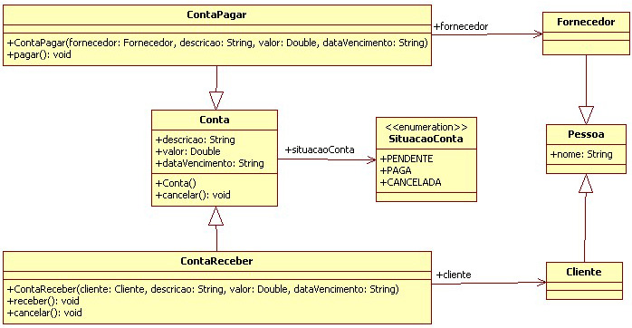

# [5.17. Desafio: herança e sobreposição](https://app.algaworks.com/aulas/82/desafio-heranca-e-sobreposicao?pagina=0)

Beba água, sente-se confortavelmente na cadeira, desligue a TV e feche a porta. Você precisará de bastante concentração para fazer esse desafio!

Se você prestou atenção nas aulas, não será muito difícil, mas você pode achar trabalhoso ou ficar um pouco confuso, pois precisará trabalhar com 8 arquivos ao mesmo tempo, entre classes e enumerações.

O poder da orientação a objetos está quando diversas classes estão envolvidas, comunicando-se entre si. Ao final desse trabalho, você conseguirá entender ainda melhor sobre o que estamos falando.

Este desafio é uma continuação do anterior, sobre o sistema financeiro para sua empresa. Você pensou bastante e decidiu incluir o gerenciamento de contas a receber também, além de contas a pagar, que já estava sendo desenvolvido.

Você solicitou a especificação das classes para seu analista e recebeu o diagrama de classes abaixo:

<!-- imagem -->


Antes de começar a codificar, é importante notar as principais mudanças:

1. Foi criada uma nova classe chamada Pessoa e a classe Fornecedor herda dessa nova classe.
2. O atributo da classe Fornecedor foi transferido para a classe Pessoa.
Uma nova classe chamada Cliente foi criada. Essa classe herda Pessoa.
3. Foi criada uma nova classe chamada Conta e a classe ContaPagar herda dessa nova classe.
4. Os atributos, o método cancelar() e o construtor padrão da classe ContaPagar foram transferidos para a classe Conta.
5. Foi criada uma nova classe chamada ContaReceber que herda da classe Conta.
6. A classe ContaReceber possui o método cancelar(). Isso é uma sobreposição ao método de mesmo nome da classe Conta. Este método deve verificar se a conta a receber possui valor maior que 50 mil, pois só permitiremos o cancelamento de contas a receber para contas abaixo desse valor (vamos fingir que esse é um requisito do negócio).

Para testar se suas classes estão funcionando, compile também e execute a classe Principal abaixo, que foi modificada:

```java
package com.algaworks.cursojava.financeiro;

import com.algaworks.cursojava.financeiro.modelo.ContaPagar;
import com.algaworks.cursojava.financeiro.modelo.ContaReceber;
import com.algaworks.cursojava.financeiro.modelo.Fornecedor;
import com.algaworks.cursojava.financeiro.modelo.Cliente;

public class Principal {

	public static void main(String[] args) {
		// instanciando fornecedores
		Fornecedor imobiliaria = new Fornecedor();
		imobiliaria.setNome("Casa & Cia Negócios Imobiliários");
		Fornecedor mercado = new Fornecedor();
		mercado.setNome("Mercado do João");
		
		// instanciando clientes
		Cliente atacadista = new Cliente();
		atacadista.setNome("Triângulo Quadrado Atacadista");
		Cliente telecom = new Cliente();
		telecom.setNome("FoneNet Telecomunicações");
		
		// instanciando contas a pagar
		ContaPagar contaPagar1 = new ContaPagar();
		contaPagar1.setDescricao("Aluguel da matriz");
		contaPagar1.setValor(1230d);
		contaPagar1.setDataVencimento("10/05/2012");
		contaPagar1.setFornecedor(imobiliaria);
		
		ContaPagar contaPagar2 = new ContaPagar(mercado, "Compras do mês", 390d, "19/05/2012");
		
		// instanciando contas a receber
		ContaReceber contaReceber1 = new ContaReceber();
		contaReceber1.setDescricao("Desenvolvimento de projeto de logística em Java");
		contaReceber1.setValor(89500d);
		contaReceber1.setDataVencimento("23/05/2012");
		contaReceber1.setCliente(atacadista);
		
		ContaReceber contaReceber2 = new ContaReceber(telecom, "Manutenção em sistema de conta online", 
			53200d, "13/05/2012");
		
		// pagamento e cancelamento de contas a pagar
		contaPagar1.pagar();
		contaPagar2.cancelar();

		// recebimento e cancelamento de contas a receber
		contaReceber1.receber();
		contaReceber2.cancelar();
	}

}
```
Mãos à obra! Não se preocupe se começar a dar muitos erros de compilação. Apenas tenha paciência e tente resolver um problema de cada vez. Para quem está aprendendo e até para profissionais experientes com orientação a objetos, é normal surgirem vários erros durante uma mudança tão grande como essa.

Em um projeto real, você não teria a resolução do problema facilmente como neste curso, por isso, se achar o desafio difícil, gaste pelo menos 2 ou 3 horas para tentar fazer você mesmo antes de ver o código-fonte resolvido.